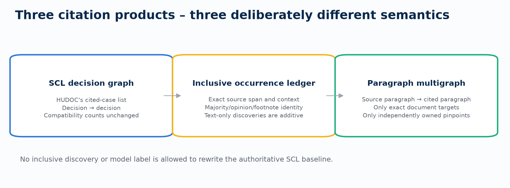
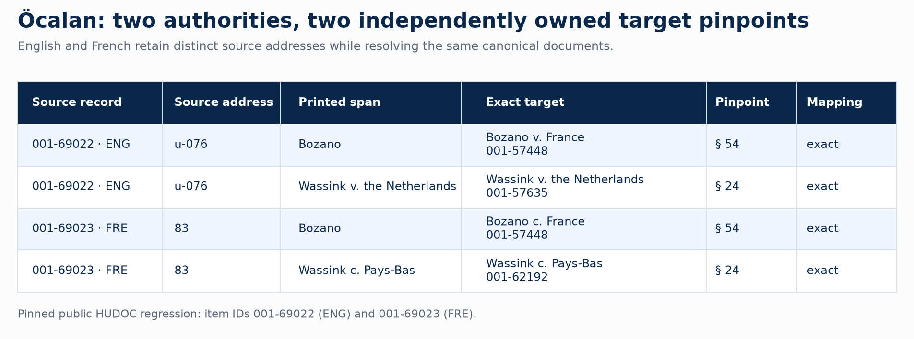
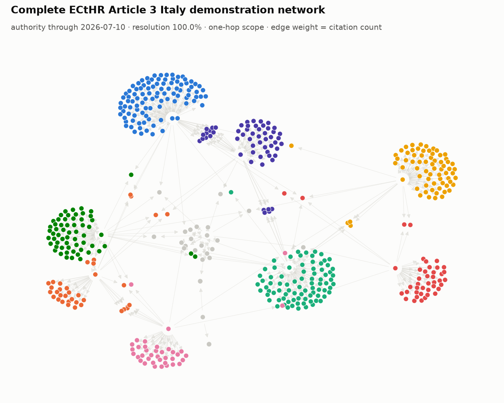

# Worked examples

These examples show the kinds of research artifacts `echr-py` produces. They
are reproducible demonstrations, not claims about the complete ECtHR corpus.

## Acquire and inspect a multilingual case

```bash
echr-py fetch-case --appno 46221/99 --with-text --out ocalan.json
echr-py versions list --ecli ECLI:CE:ECHR:2005:0512JUD004622199
echr-py versions download \
  --ecli ECLI:CE:ECHR:2005:0512JUD004622199 \
  --formats html,txt,md,docx --out ocalan/
```

The manifest records language, official/translation status, item ID,
retrieval outcome, bytes, and SHA-256. The rich case model retains sections,
stable paragraph addresses, the deciding bench, individual opinions, and the
native `represented_by` metadata field. Word-style footnotes remain linked to
their invoking paragraph/opinion and render as ordinary Markdown footnotes.

## Build three deliberately separate citation products

```bash
echr-py citations resolve --in cases.parquet --out citations/
echr-py citations locate --in cases.parquet \
  --resolution-dir citations/ --scope inclusive --out citations/
echr-py graph export --kind citation-scl --format json \
  --in citations/ --out decision-graph.json
echr-py graph export --kind citation-paragraph --format html \
  --in citations/ --out paragraph-graph.html --max-nodes 1000
```

The SCL decision graph remains unchanged for compatibility. Inclusive
occurrences add exact source spans and majority/opinion identity. Paragraph
edges are emitted only when a printed pinpoint belongs to that citation and
maps to the exact cited document.



The pinned Öcalan regression makes the paragraph contract concrete: one source
context contains *Bozano* § 54 and *Wassink* § 24, and each pinpoint stays with
its own cited-case mention in both language renditions.



Both figures have machine-readable provenance sidecars in `docs/images/` and
can be regenerated with:

```bash
python examples/build_readme_showcase.py --out docs/images
```



The pictured ten-source-document demonstration contains 1,124 resolved SCL
mentions, 509 nodes, and 562 aggregated edges. Its scope and hashes are in the
[provenance manifest](images/citation-network-provenance.json).

## Generate and embed an offline interactive network

The graph viewer vendors D3 into one HTML file. It makes no CDN request and
supports search, filters, direction/weight controls, component isolation,
attribute-driven colour and size, details, and explicit pruning.

```bash
python examples/build_embedded_network.py --out citation-example.html
```

Open the file directly, attach it to a research bundle, or host it alongside a
paper/project page. A same-origin page can embed it without a server-side graph
application:

```html
<iframe
  src="citation-example.html"
  title="Interactive paragraph citation network"
  width="100%"
  height="720"
  loading="lazy">
</iframe>
```

In Jupyter:

```python
from IPython.display import IFrame

IFrame("citation-example.html", width="100%", height=720)
```

## Search paragraphs lexically or semantically

```bash
echr-py local index-paragraphs \
  --data-dir corpus/ --database corpus/paragraphs.sqlite
echr-py embeddings build \
  --database corpus/paragraphs.sqlite --provider YOUR_PROVIDER \
  --model YOUR_EXACT_MODEL --model-revision YOUR_EXACT_MODEL_COMMIT \
  --out corpus/embeddings/
echr-py local paragraphs 'effective investigation' \
  --database corpus/paragraphs.sqlite --mode hybrid --section the_law
```

Lexical, dense, and reciprocal-rank-fused scores remain separate in the
result. Dense search refuses a stale corpus/model manifest rather than silently
mixing incompatible vectors.

## Create optional, evidence-verified citation-use labels

```bash
echr-py study init citation-use \
  --source citations/occurrences.parquet \
  --provider openai --model YOUR_EXPLICIT_MODEL \
  --taxonomy multiaxial --out citation-use.yaml
echr-py study validate citation-use.yaml
echr-py study plan citation-use.yaml --out runs/citation-use/
echr-py study run citation-use.yaml --out runs/citation-use/
```

The optional model layer can classify treatment, function, stance, or a custom
study schema. Every requested quotation is checked against the addressed
source. Invalid evidence is rejected, and labels never rewrite deterministic
citation identity or graph counts.

## Reproduce the Mumford text-only baseline

```bash
echr-py citations benchmark fetch mumford --out benchmarks/mumford/
echr-py citations benchmark import --kind mumford \
  --source benchmarks/mumford/source/ --out benchmarks/mumford/imported/
python examples/benchmark_mumford_discovery.py \
  --imported benchmarks/mumford/imported/ \
  --out benchmarks/mumford/text-only/
```

The identity-gated v2 run aligned 2,684 of 5,481 selective annotations (49.0%)
one-to-one: 2,626 were strict source-span matches and 58 used normalized
identity/paragraph context. It abstained on 2,004 ambiguous annotations. An
older 78.2% proxy allowed one occurrence to support multiple annotations and
is retained only in the result artifact for methodological provenance.
It excludes SCL gazetteers, HUDOC target lookup, and optional labels; because
the annotations are not exhaustive negatives, it cannot estimate precision.
See the
[compact result](benchmarks/mumford-text-only-baseline.json).
The [five-case SCL-assisted audit](benchmarks/five-case-curated-audit.md)
records harder cases, manual inspection, and the failure modes found.

To compare a full inclusive occurrence artifact, project its whole-document
coordinates into the imported XMI text before alignment:

```bash
python examples/benchmark_mumford_inclusive.py \
  --imported benchmarks/mumford/imported/ \
  --occurrences corpus/citations/occurrences.parquet \
  --out benchmarks/mumford/inclusive/
```

The equivalent CLI path is `citations benchmark compare --kind mumford` with
`--documents`, `--reference-scope echr`, and optional `--projected-out`.
Projection accepts only a unique normalized paragraph or citation window and
reports every in-scope abstention. The result measures recovery of Mumford's
selected ECtHR annotations. It does not estimate detector precision, and the
reference does not verify canonical target documents or target paragraphs.
The dated [full-inclusive audit](benchmarks/mumford-full-inclusive-audit.json)
pins the evaluated inputs, hashes, denominators, and output qualifications.
